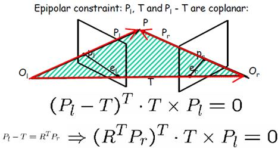

#### 本质矩阵

本质矩阵对规范化摄像机的两个视点图像间的极几何关系进行代数描述

上图中有两个摄像机，两个摄像机中心用 $O_l$ 和 $O_r$ 来表示，他们之间空间变换关系用旋转 R 和平移 T 来表示。这里有一个空间点 P 分别在左右两个摄像机的成像平面上点为 $P_l$ 和 $P_r$ 而且$P_l$ 在左侧成像平面中的坐标为 $u,v$，$P_r$ 在左侧成像平面中的坐标为 $u^{\prime},v^{\prime}$。

#### 规范化摄像机

规范化摄像机的内参数为一个单位矩阵 K 和 $K^{\prime}$，表示如下
$$
K  = \begin{bmatrix} 1 & 0 & 0 \\ 0 & 1 & 0 \\ 0 & 0 & 1\end{bmatrix}
$$
那么规范化摄像机具有哪些特点，摄像机坐标下三维点的欧式(非齐次)坐标等于图像点的齐次坐标

$$
P^{\prime} = \begin{bmatrix} x \\ y \\ z \end{bmatrix} = \begin{bmatrix} 1 & 0 & 0 & 0\\ 0 & 1 & 0 & 0 \\ 0 & 0 & 1 & 0 \end{bmatrix} \begin{bmatrix} x \\ y \\ z \\ 1\end{bmatrix}
$$

$$
M = K \begin{bmatrix} I & 0 \end{bmatrix}
$$

点 p 在左侧像平面的点记作 $p_l$ 而在右侧像平面上点记作为 $p_r$ ，$p_l$ 点在的坐标为 $u,v$ ，空间点 P 在 $O_l$ 坐标系下的非齐次坐标为 $(u,v,1)$ 而 P 在 $O_r$ 坐标系下的非齐次坐标为 $(u^{\prime}, v^{\prime},1)$

首先将 $O_r$ 和 $P_r$ 都放置 $O_l$ 也就是左侧摄像机中心坐标下来表示。
$$
P_r = RP_l + T
$$
那么 $O_l$ 看成世界坐标系的点，那么 $P_r$ 在 $O_l$ 坐标系下点的坐标表示如下
$$
R^T(P_r - T)
$$
 $O_r$ 在 $O_l$ 坐标系下点的坐标表示如下
$$
R^T(-T) = -R^TT
$$

$$
[R^TT \times (R^TP_r - R^TT)]^T P_l = 0
$$

$$
a \times b = \begin{bmatrix} 0 & -a_z & a_y \\ a_z & 0 & -a_x \\ -a_y & a_x & 0 \end{bmatrix} \begin{bmatrix} b_x \\ b_y \\ b_z \end{bmatrix} = [a_X] b
$$

$$
P_r^T E P_l = 0\\
P_r^T[T_x]RP_l = 0
$$

规范化摄像机下，对应点之间的关系。

- 对于 $P_l$ 对应的极线是 $l_r(l_r = E P_l)$ 
- 对于 $P_r$ 对应的极线是 $l_l(l_l = E^TP_r)$
- $Ee_l = 0$ 与 $E^Te_r = 0$
- E 是奇异的(zhi)
- 
