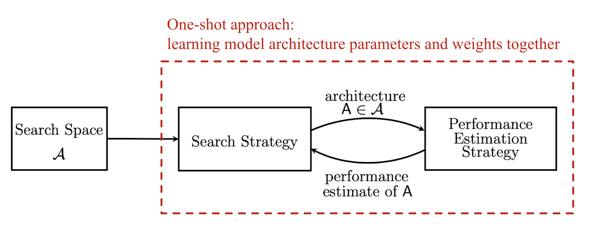
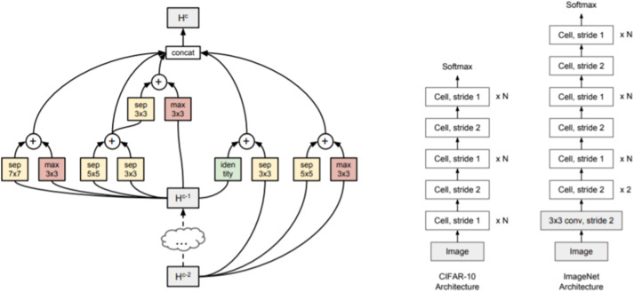
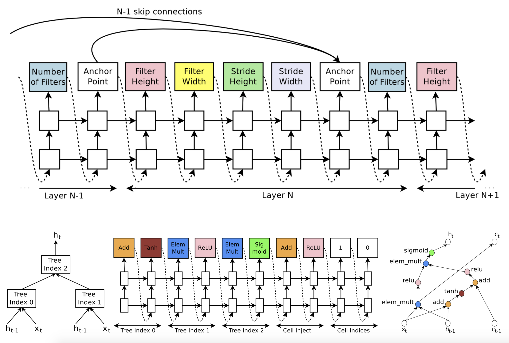

## 现搭建基础网络

最近比较火 NAS 
可能看了之后会有一些疑问，我们今天带着这些疑问再重新看一看 NAS，我们知道在 NAS 有 3 个部分分别是搜索空间、搜索策略和性能评估。

**NAS** 并不是最近才提出的算法，早在上个世纪 19 年代就已经被提出，只不过和深度学习类似，因为最近算力的提升、以及深度学习发展才再次发光发热，简单来说就是用于搜索最佳网络的架构网络，和 Meta 学习也是有点相似的，不过 Meta 学习是基于大量先验任务，通过学习潜在学习方法来实现算法，更加适合受数据量限制或者难以学习到显著特征的任务。而 NAS 这是优化网络结构设计，或者说是一种调参方法。优化方法有点类似暴力搜索，所以最近大家都在做的是对网络进行减枝。

### 搜索空间
有两种搜索方式，跨层多分支，中间层的类型都是可以被搜索，卷积核的结构都包括在搜索空间内。会将把网络切分为基础单元(cell)。

定义适当的搜索空间更利于提升网络的性能的下限，搜索空间复杂程度决定了网络结构的潜力。

#### 单元(cell)

神经网络映射，例如我们通常网络神经网结构都是一个有向无环图，早期比较简单简单的全连接神经网络和卷积神经网络结构可以看成一个链表，cell 也可以看成张量 tensor 的变换从一个结构。但是对于 inception net 和 resnet 以及 densenet 中的结点通常多个前驱和多个后置，这样的结构会变得相对复杂，图类型也是由搜索空间来定义，除此之外层的超参数也都包括在搜索空间内。

#### 块(block)
每个模块符号化了表示为一个 5 元组，其中两个输入 $I_1,I_2$ 各自的操作为 $O_1,O_2$ 和 C 表示如何合并到一起去得到输出

$$|\cal{B}_b| = |\cal{I}_b|^2 \times |\cal{O}|^2 \times |\cal{C}|$$

#### 离散变连续，使用松弛 relaxation
##### 对张量的操作有若干中
- 3x3 depthwise-separatable conv
- 5x5 sep 
- 3x3 max pooling
- 3x3 avarage pooling
通过 softmax 将标量变为二选一，给定义输入 x 给出一个输出，每一次都是硬性地选择一个。强化学习则是换成概率

$$O^{i,j} = \sum_{o \in \cal{O}}\frac{\exp (\alpha_o^{(i,j)})}{\sum_{o^{\prime}\in \cal{O}} \exp(\alpha_{o^{\prime}}^{(i,j)})} o(x)$$

- 优化、训练完后，就选择概率最大的那项即可

$$o^{(i,j)} = \argmax_{x \in \cal{O}} \alpha_o^{(i,j)}$$

#### 损失函数
- 优化目标函数是用验证集$L_{val}$
- 当网络结构固定后，用训练集训练网络参数$L_{train}$
- BiLevel 优化问题，目标优化验证集最小，训练集上损失函数最小
$$\begin{aligned}
    \min_{\alpha} L_{val}(w^*(\alpha),\alpha)\\
    s.t. \, w^*(\alpha) = \argmin_w L_{train}(w,\alpha)
\end{aligned}$$
#### BiLevel 优化问题的优化方法
- 不能双层循环、每回进行以
- 联想到 SVM 时候的 KKT 算法也就是有条件约束问题
- 可以让 train 和 val 两个 loss 一起优化
- SGD 同时一步来完成优化

$$\nabla_{\alpha} L_{eval}(w^*(\alpha),\alpha) \approx \nabla_{\alpha}(w - \epsilon \nabla_w L_{train}(w,\alpha),\alpha)$$

### 搜索策略
- 本质上就是超参数优化的问题，主流搜索策略强化学习、遗传学习以及基于梯度的优化。强化学习，有点类似 GAN，生成的是网络结构，鉴别的是网络效果。用控制器(RNN)生成一个不定长子网络串，并且训练子网络，以子网络评估得到精度值作为反馈，更新控制器参数。网络生成问题可以简化序列生成问题，按层依次预测网络结构，每 5 个输出用于定义网络结构层，
- 目标就是子网络在测试集上数学期望，

#### 基于强化学习问题

#### 网络的拓扑结构
#### 每层的类型
除了输入和输出层以外的中间层的类型是可选的，这些可选包括全连接层、卷基层、反卷积层、空洞卷积、池化层和激活层等
#### 每层内部的超参数

#### 编码器(encoder)

#### 性能评估策略
NAS 算法需要估计一个给定神经网络结构的性能，这称为性能评估策略

