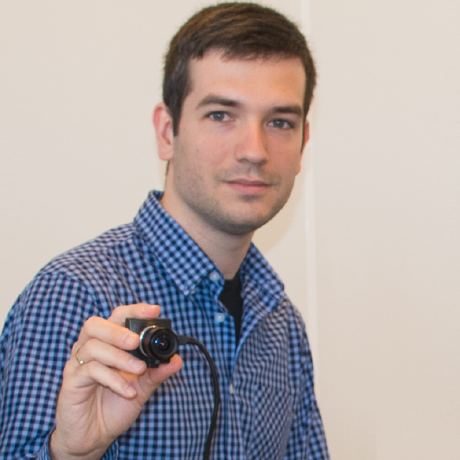

### 计算机视觉

- 相机几何和小孔成像
#### 小孔成像
- 小孔成像的问题就是进入小孔光线变少，造成胶片太暗。因此引入了凸透镜成像，因为凸透镜有焦距的概念，也就是景深
- 

### ORB SLAM 系统
- 用 ORB_SLAM2 来构建地图
- ORB_SLAM2 适合单目、双目、RGB-D 三种常用
- 稀疏建图
- 室内室外环境通吃，能够长时间工作
- 代码开源

- 现在 facebook 做数学科学家

### 场景识别(Place Recognition)
- 判断相机是否来到过曾经去过的位置
- 回环检测和重定位相关
#### 常用的方法
- Image2Image: 仅凭借图像特征的关联来识别
- Image2Map: 图像特征和地图点的关联来识别
- Map2Map: 地图点和地图点的关联来识别

### 地图初始化
- 需要三角化创建初始地图点
- 三角化时需要初始两帧的相机姿态

#### 常用方法
- 使用逆深度滤波器
- 多视图几何

