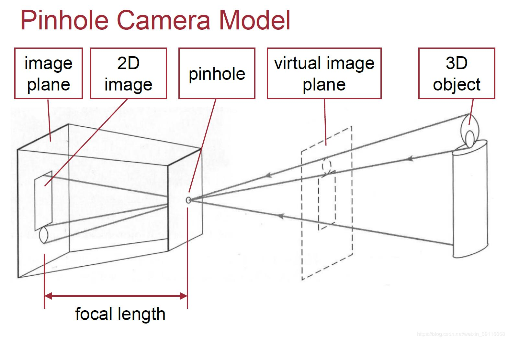
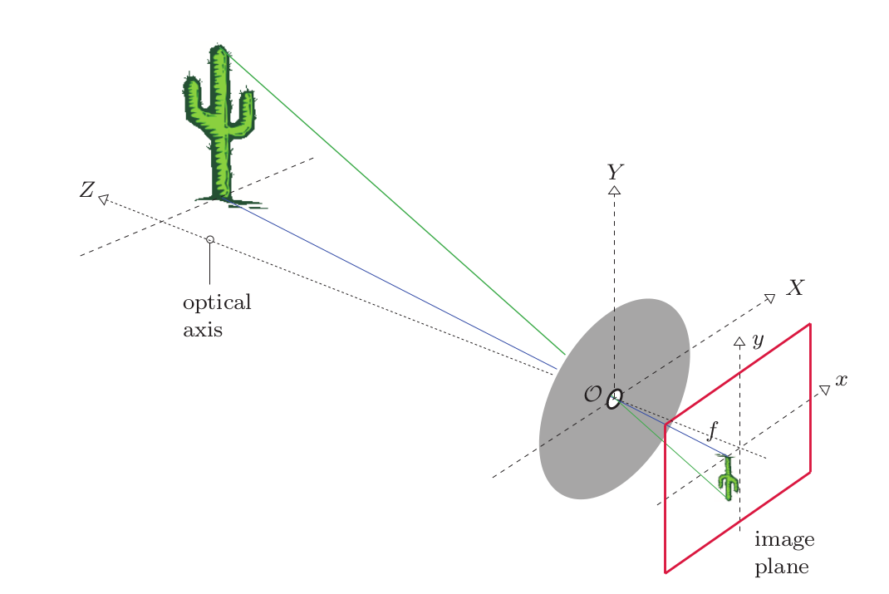
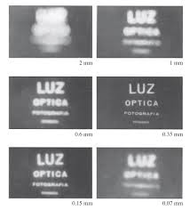
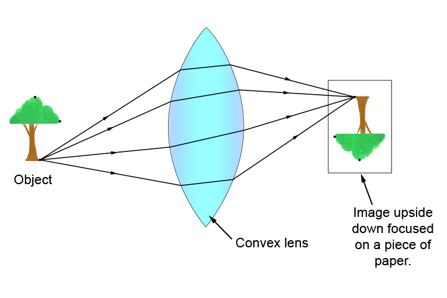
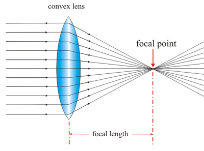
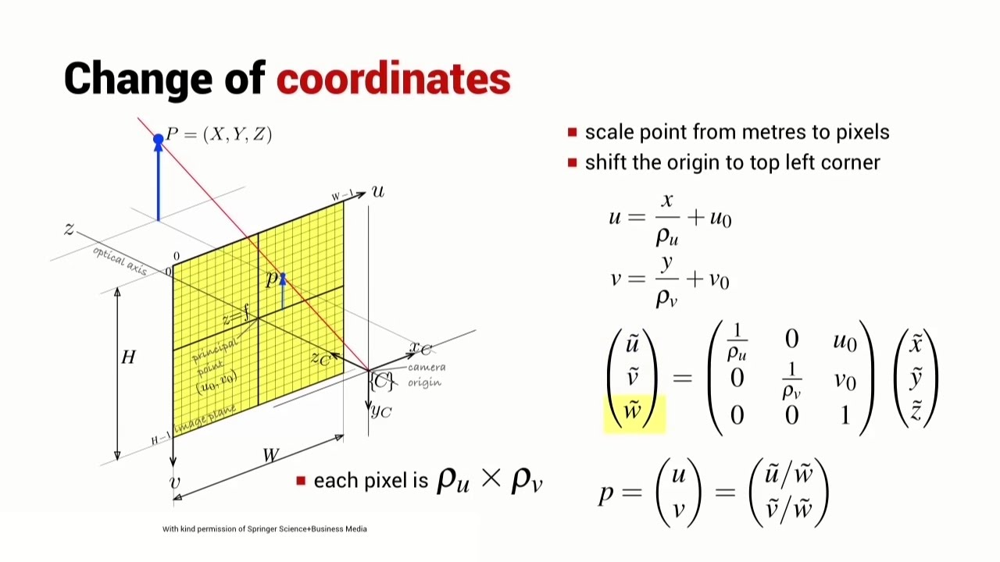

### 摄像机视觉
- 小孔成像
- 针孔摄像机
- 凸透镜

真实世界物体呈现在 2D 图像

将胶片直接放置在物体前方，不过这样做法问题，所以在胶片和物体之间放上一个隔板，隔板的中间开上小孔，通过带有小孔的隔板就可以减少模糊。这就是针孔

- image plane 像平面
- 2D image 
- forcal length 焦距
- pinhole 小孔，光圈
- virtual image plane 虚拟像平面
- 3D object 真实物体
- 虚拟像平面和像平面除了方向不一致，其他完全都一样

$$\frac{y^{\prime}}{f} = \frac{y}{z} \rightarrow y^{\prime} = f\frac{y}{z}$$

$$\frac{x^{\prime}}{f} = \frac{x}{z} \rightarrow x^{\prime} = f\frac{x}{z}$$

利用三角形相似法制，

$$p = \begin{bmatrix}
    x\\
    y\\
    z
\end{bmatrix} \rightarrow p^{\prime} = \begin{bmatrix}
    x^{\prime}\\
    y^{\prime}\\
\end{bmatrix}$$

- 小孔也叫做光圈，通过上图我们可以看出调整光圈的大小对成像的影响，光圈越小图像就越清晰，也就是胶片上一个点对应真实世界多个点的坐标。缩小光圈又会因为到达胶片上光线变少而图像变暗。

- 凸透镜将多条光线聚焦到胶片上，增加了照片的亮度
  

- 凸透镜将光线聚焦到胶片上
- 所有平行于光轴的光线都会会聚到焦点，焦点到透镜中心点的距离称为**焦距**
- 穿过中心的光线的方向不发生改变

#### 近轴折射模型

### 像平面到像素平面
学习摄像机几何，前面空间点到像素平面，有两点需要注意，第一点是像素到米，第二点坐标原点的位置。相机坐标系和像坐标系通常是以米为单位。

##### 偏置
$$(x,y,z) \rightarrow (f\frac{x}{z}+c_x,f\frac{y}{z} + c_y)$$

##### 单位变换

$$(x,y,z) \rightarrow \left(f k\frac{x}{z}+c_x,fl\frac{y}{z} + c_y \right)$$

$$\begin{aligned}
    k,l : \frac{pixel}{m}\\
    f:m
\end{aligned}$$

$$\begin{gathered}
    \alpha = fk\\
    \beta = fl
\end{gathered}$$

- 空间点到像素单位，三维点到像素点的映射。
- 空间点 p 到图像点 $p^{\prime}$ 的变换是线性变换

$$p(x,y,z) \rightarrow p^{\prime} = \left( \alpha\frac{x}{z}+c_x,\beta\frac{y}{z} + c_y \right)$$

- $(u,v)$ 与 $z$ 不是一个常数而是一个变量所以不是线性映射

#### 齐次坐标

$$(x,y) \rightarrow \begin{bmatrix}
    x\\
    y\\
    1
\end{bmatrix} \, (x,y,z) \rightarrow \begin{bmatrix}
    x \\
    y \\
    z \\
    1
\end{bmatrix}$$

$$\begin{bmatrix}
    x\\
    y\\
    w
\end{bmatrix} \rightarrow (x/w,y/w) \begin{bmatrix}
    x\\
    y\\
    z\\
    w\\
\end{bmatrix} \rightarrow (x/w,y/w,z/w)$$

$$p_h^{\prime} = \begin{bmatrix}
    \alpha x + c_x z\\
    \beta y + c_y z\\
    z
\end{bmatrix} = \begin{bmatrix}
    \alpha & 0 & c_x & 0\\
    0 & \beta & c_y & 0\\
    0 & 0 & 1 & 0\\
\end{bmatrix} \begin{bmatrix}
    x\\
    y\\
    z\\
    1
\end{bmatrix}$$

$$p^{\prime} =  \begin{bmatrix}
    \alpha & 0 & c_x & 0\\
    0 & \beta & c_y & 0\\
    0 & 0 & 1 & 0\\
\end{bmatrix}  \begin{bmatrix}
    x\\
    y\\
    z\\
    1
\end{bmatrix}$$

- 图像坐标系两个轴不垂直，需要考虑不垂直的情况

$$M = \begin{bmatrix}
    \alpha & -\alpha \cos \theta & c_x & 0\\
    0 & \frac{\beta}{\sin \theta} & c_y & 0\\
    0 & 0 & 1 & 0\\
\end{bmatrix}$$

$$\theta = 90 \, \cos \theta = 0 \, \sin \theta = 1$$

- 摄像机的内参数完全决定空间点到图像点映射关系

$$K \begin{bmatrix}
    I & 0
\end{bmatrix}P \rightarrow MP$$
- 5 个自由度 $\alpha,\beta,\theta,c_x,c_y$

$$p^{\prime} = \begin{bmatrix}
    x \\
    y\\
    z
\end{bmatrix} = \begin{bmatrix}
    1 & 0 & 0 & 0 \\
    0 & 1 & 0 & 0 \\
    0 & 0 & 1 & 0 \\
\end{bmatrix} \begin{bmatrix}
    x\\
    y\\
    z\\
    1
\end{bmatrix}$$

- 摄像机坐标系描述 3 维物体的空间信息是否方便
- 如何将物体从世界坐标行转到摄像机坐标系

$$p = \begin{bmatrix}
    R & T\\
    0 & 1
\end{bmatrix} p_w \, p_w = \begin{bmatrix}
    x_w\\
    y_w\\
    z_w\\
    1
\end{bmatrix}$$

$$ p^{\prime} = K \begin{bmatrix}
    I & 0
\end{bmatrix} p =  K \begin{bmatrix}
    I & 0
\end{bmatrix}\begin{bmatrix}
    R & T\\
    0 & 1
\end{bmatrix} p_w \ = K \begin{bmatrix}
    R & T
\end{bmatrix} p_w = MP_w$$

$$\begin{aligned}
    K_{3 \times 3}\\
    I_{3 \times 3}\\
    K [  I \, 0]_{3\times 4}\\
    P_{4\times1}
\end{aligned}$$

$$\begin{aligned}
    R_{3 \times 3}\\
    T_{3 \times 3}
\end{aligned}$$

5 + 3 + 3 = 11