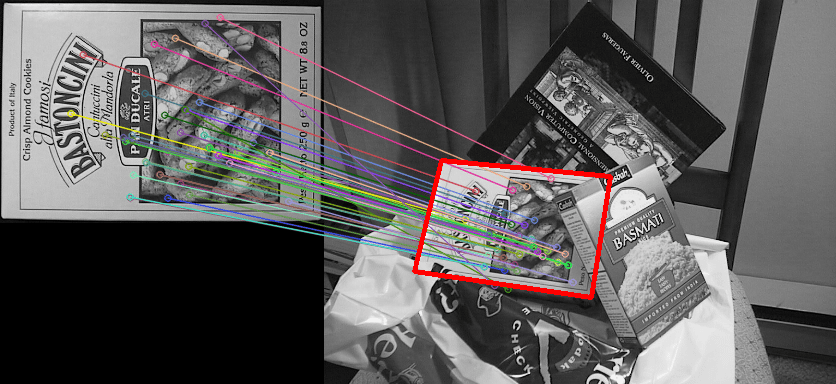
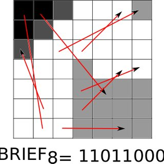
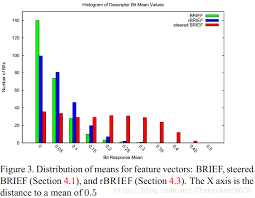
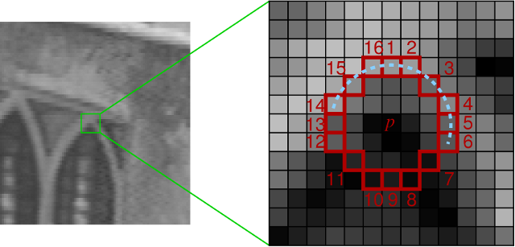

### 特征
- 像素变化比较大
- 像素梯度比较大

#### 特征的性质
- 尺度不变性
- 亮度不变性
- 旋转不变性

#### 特征提取过程
- 特征定位
- 特征描述: 方式将特征表示出来，表述为二进制字符串或者是十进制字符串来描述这个特征

#### ORB 特征的主要步骤
##### oFAST
###### 定位 oFAST 是对 FAST 改进
- **特征计算的简化**: (1,5,9,13) 不相同就认为这个区域内有特征
- **非最大值抑制**: 有点类似 maxpooling，也就是选取最大值作为代表值，那么在 oFAST 是如何应用的，其实就是 $\sum_{i} |I(i) - I(p)|$ 然后选取最大值作为特征点的位置，简化后续的计算
- **金字塔**: FAST 没有尺度不变性，为了解决 FAST 尺度不变性，也就是把一张图片不断缩小，然后用上述同样方法提取特征
- **方向**: FAST 是没有旋转不变性，将坐标系加了一个角度，然后根据这个坐标系对周围点进行索引
#### rBRIEF
- 描述方法
##### BRIEF

- 计算 BRIEF 区域一定是在之前已经计算好了，这个区域是有特征的。点对(的坐标值)是满足高斯分布的二维随机数，所以 A/B 没有严格定义，也就是在这个区域随机生成一些点对，这些点对生成满足高斯分布。
- 如果 A 像素值如果大于 B 点像素值将 p(A,B) = 1 否则为 0 从而得到二进制串。所以每一次生成点对顺序改变了那么描述子值也就发生了改变

##### steered BRIEF
- 增加了旋转不变性
- 将点对乘以旋转矩阵(oFAST 根据质心得到转后坐标系，这个坐标系和原来坐标系之间夹角就是$\theta$ 旋转矩阵)
##### rBRIEF
- 均值偏离 0.5
- 描述子之间相似，相关性高，可区分

- 30 万特征点分别计算 BRIEF(用绿色来表示)，蓝色表示 rBRIEF 而红色表示 steeredBRIEF 描述子，横轴描述子的均值距离 0.5 距离，0 表示这些点均值正好 0.5，纵坐标表示点数量，
- 绿色点的均值大部分都集中在 0.5 左右，红色 steeredBRIEF 均值比较均衡
- 描述子均值靠近 0.5 和偏离 0.5 均值，0 和 1 数量相同多时候就靠近 0.5 偏向 0 或者偏向 1 ，描述均值都很靠近 1 或者 0，这样相似度就比较低。
- 那么什么样描述子是好的描述子，均值偏离 0.5 描述子表示这些之间差别性比较差
- 256 点对
### FAST 特征

- 通过周围点来表示当前点(skip-gram)
- 用一个数组来表示，当$|I(p) - I(I)| > t$ 表示相同 1，当$|I(p) - I(I)| < t$ 表示为 0 则表示不相同
- 然后我们找到连续不相同情况来判断 p 点是否为特征点
- FAST 提取流程，以一定半径做一个圆圈，圆圈上像素点和中心点灰度上差距作为中心点和周围点是否相同

### ORB 特征