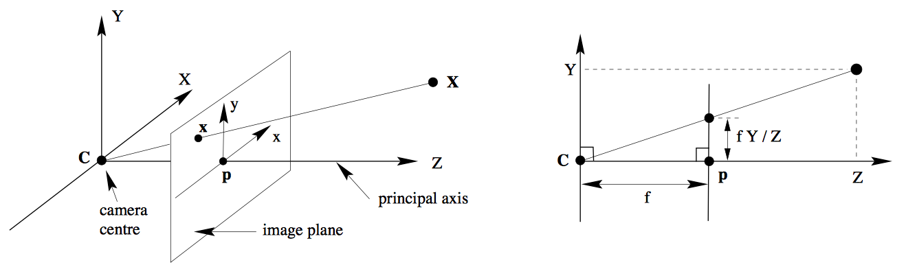
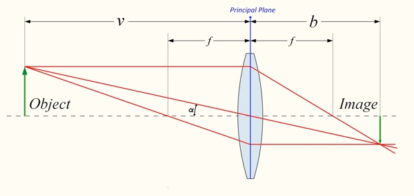
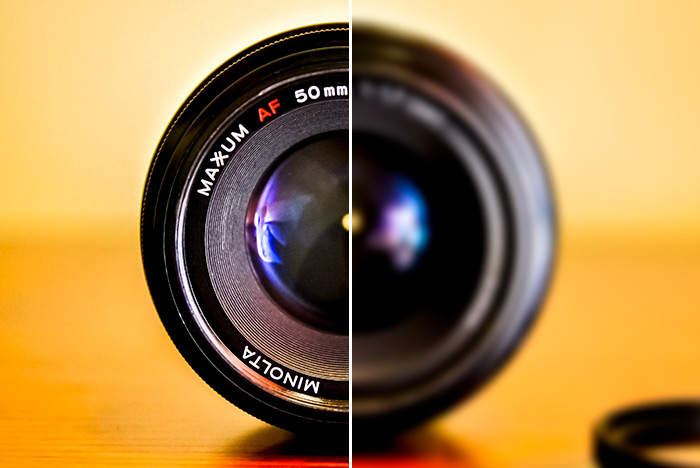
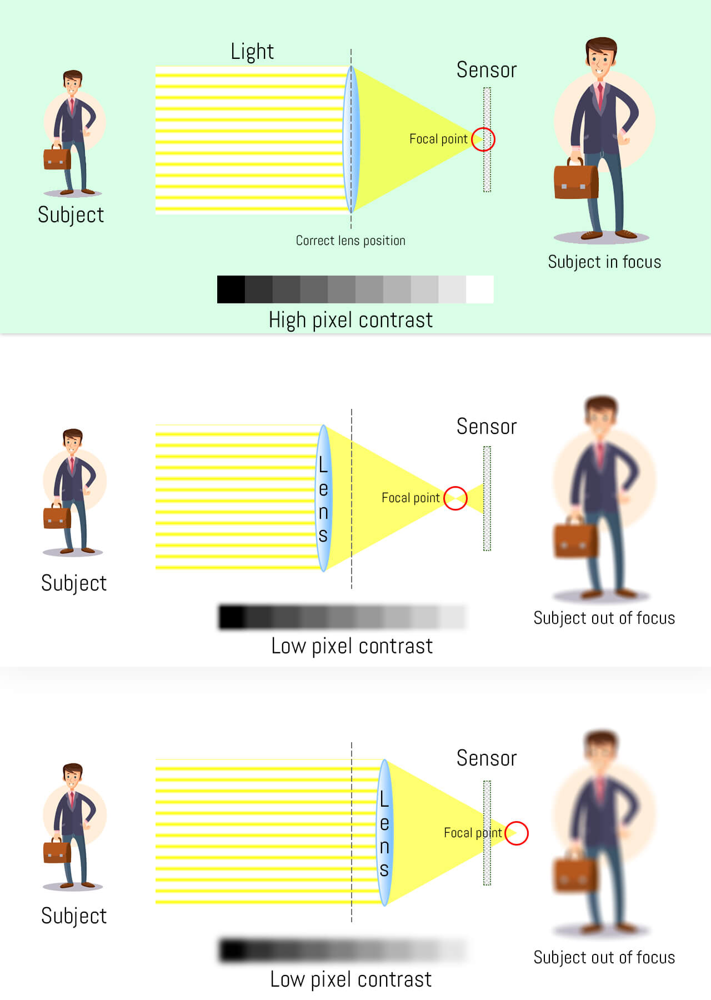
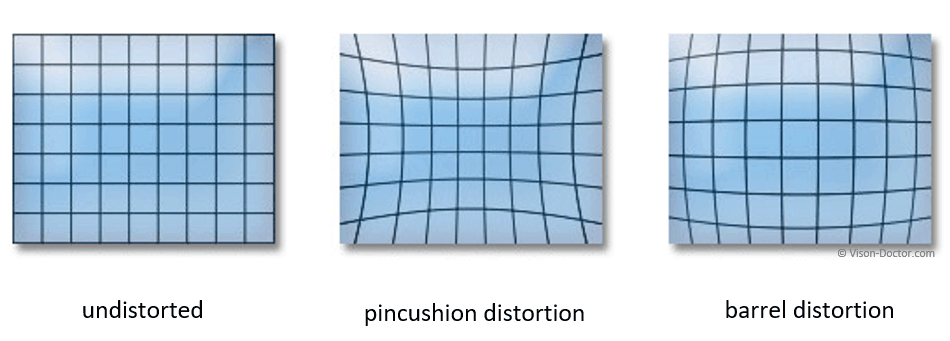
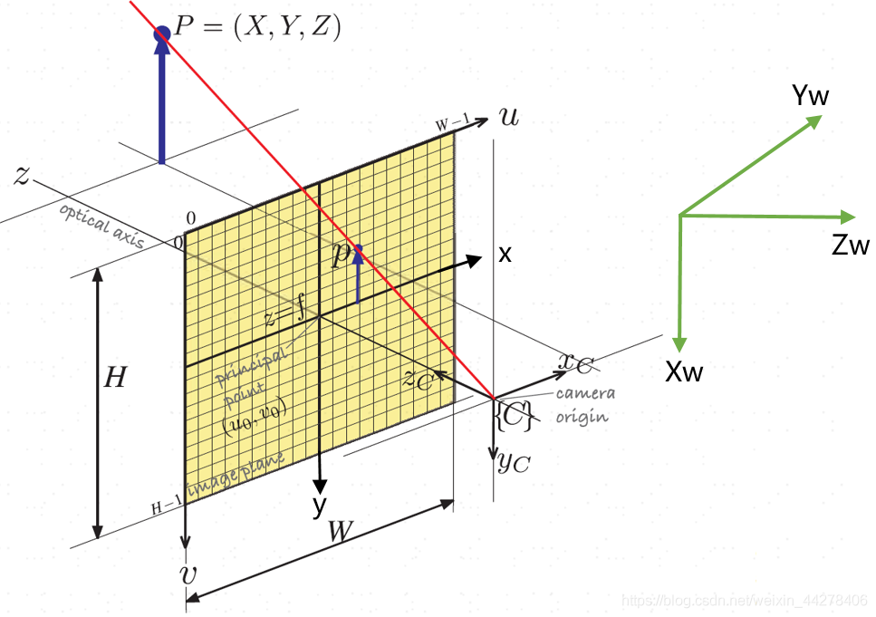

最近沉浸了一段时间，沉浸不等于放弃，而是一种酝酿的过程。那么接下来我们就来分享一下这一段时间自己整理一些干货。跟着我，相信会有所得，也希望自己也辛苦没有白费。代理如何从理论到实践来实现一个无人驾驶系统。这里说一下，分享内容会由浅入深，会做大足够细致，这样一来开始你可能会感觉有些枯燥，甚至乏味。不过只要大家耐着性子看下去，相信会有所搜索。


##### 对读者的一点要求

这里妄自称你们读者，其实各位都是我的朋友和老师。这次分享虽然足够简单、足够细致，但是还是会有一定门槛的。需要具有基础的高等数学和线性代数方面的知识，只要这样你才能够理解文章出现的公式和概念。但不必过于担心，只是基础，无需深入，也就是不能再基础的概念有所了解。

##### 对自己的一点要求

这一次对自己也提了一点要求，不能只顾自己 high。自己除了继续专注内容，也会花一些心思在文章设计上，如何让自己文字读起来有趣同时，如何让逻辑上是环环相扣以便于大家阅读，如何将晦涩抽象内容说的浅显易懂。这些都是自己在随后文章逐渐改善和加强的方面。

##### 会谈到哪些技术

我们主要专注两个技术，分别是计算机视觉技术和 SLAM 技术，无论是深度学习在计算机视觉领域的应用还是 SLAM 技术其实都是基于计算机视觉，所以个人觉得很有必要先普及一下计算机视觉基础知识。


### 3D 重建

3 维重建是自己相对于来说比较感兴趣的方向，所谓 3 维重建，就是基于单张图像或者多张图像来将 3D 环境重新构建出来。这部分内容虽然有趣，但是要想掌握这部分内容其实并非易事，因为这部分内容会涉及到许多领域的知识。这是一次从 3D 世界到 2D 世界的转换，或者说是映射。在转换过程中深度信息将会丢失或者是换一种表达方式。完成这个映射的就是摄像机。


#### 小孔摄像机

将胶片直接放置在物体前方是我们将 3 维世界直接映射到图像上一种最简单，也是最直观的做法，不过这样做的问题也是显而易见，胶片上每一个点都接受到环境中多个的物体发送出光线(信息)。所以最终在胶片上图像都是模糊的，很难记录下真实世界中物体的信息。


那么如何在摄像机和胶片间放上一个隔板，隔板的中间开上小孔，这样一来物体发射光线经过小孔后就不会发散，通过带有小孔的隔板就可以减少模糊，也就是物体上点与图像上的点形成了一一对应的关系，从而得到清晰的图像。


$$
\begin{aligned}
\frac{y^{\prime}}{f} = \frac{y}{z} \rightarrow y^{\prime} = f\frac{y}{z}\\
\frac{x^{\prime}}{f} = \frac{x}{z} \rightarrow x^{\prime} = f\frac{x}{z}
\end{aligned}
$$


这里会利用到三角形相似法则，红色表示的成像平面就是**像平面**，那么像平面到小孔的距离为 f，f 也就是我们熟悉的**焦距**。这里小孔就是光圈，还就是我们通常是研究的是和像平面关于小孔对称的**虚拟像平面**。小孔到成像物体的距离用 z 来表示。


好那么根据三角形相似法则就可以得到上面的公式，从上面公式不难看出当相机(小孔)和物体之间距离 z 固定情况，调整焦距 f 也就是成像平面到小孔之间的距离，可以调整成像的大小。相机坐标系是在光心出建立的 3 维坐标系，而在像平面上建立的是 2 维坐标系。这里 p 点为相机坐标系中的点，x、y 和 z 表示 p 点的坐标，而 p prime 表示 p 点在成像平面中的对应的点，x 和 y prime 分别表示该点在成像平面的坐标。



我们从一个轴 y 来考虑一下成像平面 y prime 和摄像机坐标系中 y 的对应关系。
$$
\frac{y^{\prime}}{f} = \frac{y}{z} \rightarrow y^{\prime} = f\frac{y}{z}
$$


$$
p = \begin{bmatrix}
    x\\
    y\\
    z
\end{bmatrix} \rightarrow p^{\prime} = \begin{bmatrix}
    x^{\prime}\\
    y^{\prime}\\
\end{bmatrix} \, \begin{aligned} x^{\prime} = f\frac{x}{z} \\ y^{\prime} = f\frac{y}{z} \end{aligned}
$$
通过这个关系就可以将空间点映射到像平面上的坐标。


通过上面的图，我们可以看出调整光圈的大小对成像的影响。上面图下标数值表示是在该大小光圈下拍摄的图像，我们可能会发现在 2mm 光圈成像是无法清晰成像的，而在 0.35mm 就可以清楚地看出字母 LUZ。光圈越小图像就越清晰，而调整光圈变大后图像就变得模糊，这是因为调整光圈变大后胶片上一个点就对应真实世界的多个点，所以造成模糊的效果。当缩小光圈时，到达胶片上的光线就变少了，所以调小光圈后图像就会变暗。

为了解决这个光线到达成像平面变少问题，才引入了透镜




不过小孔成像的缺点就是，因为光线不足所以最终造成了成像平面会比较暗。通过引入透镜后成像物体的多条光线通过透镜后会聚集到成像平面上一点，这样也就解决了成像物体光线不足的问题。凸透镜两个特性是所有平行于光轴的光线都会会聚到**焦点**，焦点到透镜中心点的距离称为**焦距**。穿过透镜中心的光线的方向是不会发生改变的。透镜焦距是跟透镜球面半径 R 和透镜折射系数 n 有关系的，公式如下
$$
f = \frac{R}{2(n-1)}
$$


那么从透镜到成像平面距离为 b 这里 $b = f + z_0$ 随后就只会考虑 b 而不会再去考虑 f 和 z_0 。虽然透镜解决了光线不足的问题，但是透镜成像并非完美，还存在同样透镜成像并非完美，通常也存在问题，接下来就会提及失焦和径向畸变的问题。


##### 失焦







在第一图像中，成像平面放在焦点处可以得到一个清晰的小光斑，可以看到清晰成像物体，在第二张和第三张图像中成像片面分别位于焦点前方或者后方都会得到一个模糊的图像，这就是失焦的现象。

##### 径向畸变

透镜的第二个问题就是径向畸变，图像像素点以畸变中心为中心点，沿着径向产生的位置偏差，从而导致图像所成的像发生形变。



这里分别列出枕形畸变(pincushion distortion)和桶形畸变(barrel distortion)。枕形畸变：又称鞍形形变，视野中边缘区域的放大率远大于光轴中心区域的放大率，常用在远摄镜头中（上图中）。桶形畸变，与枕形畸变相反，视野中光轴中心区域的放大率远大于边缘区域的放大率，常出现在广角镜头和鱼眼镜头中（上图右）


#### 像平面到像素平面

摄像机几何中，如何将像素平面上的点对应到摄像机坐标上，有两点需要注意，第一点是像素到米之间单位转换，相机坐标系通常是以米为单位，而在图像平面内是以像素为单位。第二点坐标原点的位置，通常在图像。



##### 偏置

通常在图像平面我们喜欢以图像左上角作为原点，而在摄像机坐标系是以摄像头中心点为原点，这样摄像机坐标中心和图像的中心之间就存在偏差用 $c_x$ 和 $c_y$ 来表示偏差，在摄像机的点 (x, y, z) 。
$$
(x,y,z) \rightarrow (f\frac{x}{z}+c_x,f\frac{y}{z} + c_y)
$$


##### 单位变换

$$
(x,y,z) \rightarrow \left(f k\frac{x}{z}+c_x,fl\frac{y}{z} + c_y \right)
$$

这里 k 和 l 表示一米有多少个像素，这两个参数是摄像机感光元件所决定。因为像素可能不是方形，所以 k 和 l 值可能不相等。


$$
\begin{aligned}
    k,l : \frac{pixel}{m}\\
    f:m
\end{aligned}
$$
可以用 alpha 或者 beta 来表示 fk 和 fl ，这一来可以简化公式的表达为如下公式，
$$
\begin{gathered}
    \alpha = fk\\
    \beta = fl
\end{gathered}
$$

$$
p(x,y,z) \rightarrow p^{\prime} = \left( \alpha\frac{x}{z}+c_x,\beta\frac{y}{z} + c_y \right)
$$
(u,v)  与 z 不是一个常数，而是一个变量 u,v 与 x, y 不是线性关系，因为这里还有一个 z 是变量，那么我们希望找到 u,v 到 x,y 的线性变换，这里介绍一下齐次坐标的概念。那么如果 p 到 $p^{\prime}$ 不是线性映射，那么我们希望找到一种方法将其 p 到 $p^{\prime}$ 转换为线性映射。


$$
(x,y) \rightarrow \begin{bmatrix}
    x\\
    y\\
    1
\end{bmatrix} \, (x,y,z) \rightarrow \begin{bmatrix}
    x \\
    y \\
    z \\
    1
\end{bmatrix}
$$
那么对于平面上的点(x,y)和空间上点(x,y,z) 可以通过为这些向量添加一个维度，数值为 1 来将其转换齐次坐标。随后会专门拿出一个分享给大家介绍齐次坐标，以及齐次坐标的作用。那么反过来如果想要把齐次坐标变为欧式坐标就是除最后一个维度以外所有维度的值都除以最后一个维度的值后得到坐标就是欧式坐标，如下


$$
\begin{bmatrix}
    x\\
    y\\
    w
\end{bmatrix} \rightarrow (x/w,y/w) \begin{bmatrix}
    x\\
    y\\
    z\\
    w\\
\end{bmatrix} \rightarrow (x/w,y/w,z/w)
$$


在齐次坐标中如何两个坐标存在一定比例关系，那么他们转换得到欧式坐标是同一个坐标例如
$$
\begin{bmatrix}
    1\\
    1\\
    1
\end{bmatrix} = (1,1) \,\begin{bmatrix}
    2\\
    2\\
    2
\end{bmatrix} = (1,1)
$$
例如齐次坐标 [1,1,1] 和 [2,2,2] 他们转换为欧式坐标后得到结果是相同的。有了齐次坐标的概念，我们将上面问题用齐次坐标来进行表达如下


$$
p_h^{\prime} = \begin{bmatrix}
    \alpha x + c_x z\\
    \beta y + c_y z\\
    z
\end{bmatrix} = \begin{bmatrix}
    \alpha & 0 & c_x & 0\\
    0 & \beta & c_y & 0\\
    0 & 0 & 1 & 0\\
\end{bmatrix} \begin{bmatrix}
    x\\
    y\\
    z\\
    1
\end{bmatrix}
$$
我们来进一步验证一下这个齐次坐标下的表达式是否和之前我们欧式坐下 p 到 $p^{\prime}$ 之间映射关系是同一个表达式。
$$
\frac{\alpha x}{z} + \frac{c_x z}{z} = \frac{\alpha x}{z} + c_x
$$
将问题转化到齐次坐标下，好处下就是我们将 2 维空间点通过一个矩阵变换就可以得到对应的 3 维空间点，这就是齐次变换，也是一个线性变换。而且在这个矩阵所有数字都是在摄像机确定好之后，也就固定了。
$$
M = \begin{bmatrix}
    \alpha & -\alpha \cos \theta & c_x & 0\\
    0 & \frac{\beta}{\sin \theta} & c_y & 0\\
    0 & 0 & 1 & 0\\
\end{bmatrix}
$$
通常这个矩阵可以理解投影矩阵，所谓投影就是将空间上点投影到平面上的矩阵。坐标中心不统一，单位不统一。图像坐标系两个轴不垂直，需要考虑不垂直的情况，上面投影矩阵 M 中 theta 就是图像平面两个坐标轴之间的夹角。其实这个 M 矩阵也叫做摄像机内参数矩阵，内参数矩阵决定了空间点到图像点的映射。之所以叫做内参数矩阵，是因为这些参数是由摄像机工艺所决定的，alpha、beta 和两个偏置 $c_x$ 和 $c_y$


$$
p^{\prime} = K \begin{bmatrix}
    I & 0
\end{bmatrix}P \rightarrow Mp
$$
在摄像机内参数矩阵中，一共有 5 个自由度，分别是 $\alpha,\beta,\theta,c_x,c_y$

接下来举例一个规范化投影变换，首先表示偏移为 0 然后像素比例为 1 。
$$
p^{\prime} = \begin{bmatrix}
    x \\
    y\\
    z
\end{bmatrix} = \begin{bmatrix}
    1 & 0 & 0 & 0 \\
    0 & 1 & 0 & 0 \\
    0 & 0 & 1 & 0 \\
\end{bmatrix} \begin{bmatrix}
    x\\
    y\\
    z\\
    1
\end{bmatrix}
$$
在规范投影摄像机中，空间点坐标和成像平面点的坐标是同一个坐标。其实现在 M 这里 3 维坐标系是以摄像机为中心的空间坐标


$$
p = \begin{bmatrix}
    R & T\\
    0 & 1
\end{bmatrix} p_w \, p_w = \begin{bmatrix}
    x_w\\
    y_w\\
    z_w\\
    1
\end{bmatrix}
$$


其实我们以摄像机坐标来表示物体在空间位置，以不同的摄像机作为坐标来表示同一个物体，物体坐标也就是不同，这样就存在问题，有时候我们需要在同一个坐标系来讨论以及研究问题。这个坐标系就是世界坐标系，那么如何将摄像机坐标中点变换为世界坐标系中的点，其实就是坐标变换的问题。其实在不同任务中，我们可能会选择一个更利于研究的坐标系来表示物体的坐标。通常会将世界坐标系下坐标转换为摄像机坐标系，然后再将摄像机坐标系下的坐标转换为成像平面内的坐标。


$$
p = \begin{bmatrix}
    R & T\\
    0 & 1
\end{bmatrix} p_w \, p_w = \begin{bmatrix}
    x_w\\
    y_w\\
    z_w\\
    1
\end{bmatrix}
$$
$p_w$ 表示世界坐标系下的点，然后经过一个旋转和平移就可以得到摄像机坐标系下的点 p


$$
p^{\prime} = K \begin{bmatrix}
    I & 0
\end{bmatrix} P =  K \begin{bmatrix}
    I & 0
\end{bmatrix}\begin{bmatrix}
    R & T\\
    0 & 1
\end{bmatrix} P_w \ = K \begin{bmatrix}
    R & T
\end{bmatrix} P_w = MP_w
$$
这里的 K 是摄像机的内参数，而 [R, T] 是摄像机的外参数，最终 M 建立摄像机平面点 $p^{\prime}$，这里 $p^{\prime}$ 是 $3 \times 1$ 的矩阵，而 K 表示 $3 \times 3$ 的矩阵。这里 k 是摄像机的内参数矩阵，I 是一个 $3 \times 3$ 的单位矩阵而 0 表示 $3 \times 1$ 的矩阵所以 [I 0] 就是 $3 \times 4$ 的矩阵，所以 P 是一个 $4 \times 1$ 的，


$$
\begin{bmatrix}
    R & T\\
    0 & 1
\end{bmatrix}
$$
在 3 维世界的旋转 R 是一个 $3 \times 3$ 的矩阵，而 T 是一个 $ 3 \times 1$ 的矩阵，所以上面的矩阵是一个 $4 \times 4$ 矩阵 而 $P_w$ 是一个 $4 \times 1$ 的矩阵所以就是，所以 $P_w$ 向量和转移矩阵相乘就得到一个 $4 \times 1$ 的矩阵。这里 M 表示从像平面到真实世界的投影矩阵。那么在 M 里一共有多少自由度，我们知道摄像机内参数有 5 个自由度，在加上摄像机坐标到真实世界坐标转换的 3 旋转和 3 个平移自由度，一共有 11 自由度。


$$
MP_w = \begin{bmatrix}
m_1\\
m_2 \\
m_3
\end{bmatrix}P_w \rightarrow^{E} \left( \frac{m_1 P_w}{m_3 P_w},\frac{m_2 P_w}{m_3 P_w} \right)
$$


#### M 是投影矩阵

$$
M = K\begin{bmatrix} R & T \end{bmatrix} = \begin{bmatrix} KR & KT \end{bmatrix} =\begin{bmatrix} A & b\end{bmatrix}\, A = \begin{bmatrix} a_1 \\ a_2\\ a_3 \end{bmatrix}
$$

这里 $M = (A b)$ 为 $3 \times 4$ 的矩阵， $a_i^T(i = 1,2,3)$ 表示由矩阵 A 的行

- M 是透视投影矩阵的一个充分必要条件是 $Det(A) \neq 0$

- M 是零倾斜透视投影矩阵的一个充分必要条件是 $Det(A) \neq 0 $ 且
  $$
  (a_1 \times a_3)(a_2 \times a_3) = 0
  $$
  

- M 是零倾斜且宽高比为 1 的透视投影矩阵的一个充分必要条件是 $Det(A) \neq 0 $ 且

$$
\begin{aligned}
(a_1 \times a_3)(a_2 \times a_3) = 0\\
(a_1 \times a_3)(a_1 \times a_3) = (a_2 \times a_3)(a_2 \times a_3) 
\end{aligned}
$$


#### 摄像机投影变换的性质

- 点投影为点
- 线投影为线
- 近大远小
- 角度不再保存
- 平行线相交


### 其他摄像机模型

$$
P^{\prime}_{3 \times 1} = MP_w = K_{3 \times 3} \begin{bmatrix} R & T \end{bmatrix}_{3 \times 4} P_{w 4 \times 1}
$$


##### 弱透视投影摄像机

$$
\begin{aligned}
x^{\prime} = \frac{f^{\prime}}{z} x\\
y^{\prime} = \frac{f^{\prime}}{z} y
\end{aligned} \rightarrow \begin{aligned}
x^{\prime} = \frac{f^{\prime}}{z_0} x\\
y^{\prime} = \frac{f^{\prime}}{z_0} y
\end{aligned}
$$


$$
P^{\prime} = MP_w = \begin{bmatrix} m_1 \\ m_2 \\ m_3 \end{bmatrix} P_w = \begin{bmatrix} m_1 P_w\\ m_2 P_w\\ m_3 P_w \end{bmatrix}
$$

$$
M = \begin{bmatrix} A & b \\ v & 1 \end{bmatrix} = \begin{bmatrix} m_1 \\ m_2 \\ m_3 \end{bmatrix}
$$

$$
MP_w = \begin{bmatrix}
m_1\\
m_2 \\
m_3
\end{bmatrix}P_w \rightarrow^{E} \left( \frac{m_1 P_w}{m_3 P_w},\frac{m_2 P_w}{m_3 P_w} \right)
$$

$$
P^{\prime} = MP_w = \begin{bmatrix} m_1 \\ m_2 \\ m_3 \end{bmatrix} P_w = \begin{bmatrix} m_1 P_w\\ m_2 P_w\\ 1 \end{bmatrix}
$$


$$
M = \begin{bmatrix} A & b \\ v & 1 \end{bmatrix} = \begin{bmatrix} m_1 \\ m_2 \\ 0 & 0 & 0 & 1\end{bmatrix}
$$

$$
\left( m_1 P_w, m_2 P_w\right)
$$


#### 正交投影摄像机

摄像机中心到像平面距离无限远时
$$
\begin{aligned}
x^{\prime} = \frac{f^{\prime}}{z} x\\
y^{\prime} = \frac{f^{\prime}}{z} y
\end{aligned} \rightarrow \begin{aligned}
x^{\prime} =  x\\
y^{\prime} = y
\end{aligned}
$$


##### 正交投影

更多应用在建筑设计或者工业设计行业

##### 弱透视投影在数学方面更简单

当物体较小且较远时准确，常用于图像识别任务

透视投影对于 3D 到 2D 映射的建模更为准确，用于运动恢复结构或 SLAM


### 摄像机标定

所谓摄像机标定就是求解摄像机的内、外参数来描述了三维世界到二维像素的映射关系


### 搜索简单形状—线

### 车道线检测


开启了自动导航时，自动导航(autopolite) 让车辆保持在车道线行驶。那么车道线检测成为了自动导航中的比较基本且重要的任务。因为要让车辆行驶在车道线上，首要任务就是识别出车道线的位置。现在这个任务是神经网络来完成，神经网络可以通过学习，来在不同环境下对车道线进行识别。不过今天介绍的车道线检测，会用到一些计算机视觉的技术、例如色彩空间、边缘检测(Canny 检测)、霍夫变换等技术。所以我们就以这个实例来带大家重温一下这些计算机视觉的技术。


不过因为车道线出现位置，已经在路面通常车道线设计通常采用与路面颜色反差比较大的白色或者黄色，所以这样降低了识别任务。我们可以利用学习到计算视觉方面知识来实现车道线检测。


我们通过关键点来识别线条，通常特征点检测会拿到一些点。这些点可能是位于一条线上，我们根据这些点来找到一个直线拟合这些点。如果对机器学习有点了解的话，自然会想到线性回归，我们就是要找到一条直线
$$
y = w x + b
$$
我们用上面方程来表示一条直线，将点 (x,y) 带入到方程中如果满足这个方程就说明这个点位于该直线上，我们定义好了


我们需要找到一个方向，也就是一个标准来衡量我们找到直线是否是接近最佳的直线。在机器学习里，叫做目标函数或者损失函数。都是高考季，所谓损失函数就是我们定义一个目标分数，然后每次模拟考试你都会看你的分数距离这个分数还有多少差距，然后不断努力来缩小这个差距。
$$
\sum_{i=1}^n (y_i - \hat{y}_i)^2
$$


这是今天重点并不是最小二乘法，但是我想关于最小二乘法再多说两句。大家可能发现了为什么我们没有使用点直线距离来做误差，而是直接用真实值 y 减去估计值 y hat ，这是为了简便运算，而且 y 减去 y hat 对于点到线距离误差是等价的。然后真实值和估计值之间差距去平方后求和作为整体误差，用于评价直线拟合这些点程度。为什么是平方呢，大家可以思考一下，其实对真实值和估计值的差取平方主要有两个原因，一个是原因是希望误差都正的，因为这些点通常是分布在线的两侧。还有就是希望对于误差进行放大，因为是取对误差取平方，所以误差会因为取平方而被放大。

不同同样这些也带来了问题，就是一些异常点会对直线拟合造成很大的影响。所以这种方式会受外点(outliers)影响很大。所以才引入了 RANSAC 算，这个算法有着悠久历史，这是因为其简单有效所以今天还是被大家在某一些场景所采用。

**RANSAC**(**RA**ndom **SA**mple **C**onsensus,随机采样一致) 算法是从一组含有外点(outliers)的数据中正确估计数学模型参数的迭代算法。“外点”一般指的的数据中的噪声，比如说匹配中的误匹配和估计曲线中的离群点。所以，RANSAC也是一种外点检测算法。RANSAC算法是一种不确定算法，它只能在一种概率下产生结果，并且这个概率会随着迭代次数的增加而加大（之后会解释为什么这个算法是这样的）。RANSAC算最早是由Fischler和Bolles在SRI上提出用来解决LDP(Location Determination Proble)问题的。


### 霍夫变换(Hough Transform)

首先霍夫变换并不是什么新的技术，霍夫变换 (Hough Transform) 是于 1962 年由Paul Hough 首次提出的。后于1972年由Richard Duda和Peter Hart推广使用，霍夫变换被应用到图像处理中，是从图像中检测几何形状的基本方法之一。开始霍夫变换用来检测图像中的直线，后来霍夫变换经过扩展可以进行任意形状物体的识别，例如圆和椭圆。


变换是空间变换，我们先从具体例子来看，先具体然后再抽象来解释一下霍夫变换


我们的任务是检测直线，前提是我们通过一些特征点提取拿到一些特征点，然后利用这些特征点来检测通过这些点的直线。在直角正交坐标系中有两个点 $(x_1,y_1)$ 和 $(x_2,y_2)$ 他们位于同一条直线上，这是点空间这条直线可以表示为 $y = a_0 x + b_0$。在 $a_0$ 和 $b_0$ 组成参数空间里，每一个点对应一条直线，而可能穿过 $(x_1,y_1)$ 点所有直线在参数空间表示为 $b = ax_1 + y_1$ ，那么在参数空间中这条穿过 $(x_1,y_1)$ 和 $(x_2,y_2)$  的直线对应于参数空间两条直线  $b = ax_1 + y_1$ 和  $b = ax_2 + y_2$ 的交点。


### 影消点与影消线

主要就是找图像上像素点与真实场景点的对应关系，这是因为影消点与影消线与三维平面上点存在一种确定的关系，所以今天在开始 3D 重建前很有必要聊一聊什么是影消点与影消线，以及他们如何对应到 3D 空间上的。通过影消点与影消线以及一些场景的先验信息我们就可以实现单张图像的 3D 重建。


- 平面上的平行线的交点、无穷远点和无穷远线

- 无穷远点和无穷远线的 2D 变换，以上两条就是在 2D 图像投影的映射关系

- 三维空间中的点线面、影消点与影消线，在三维上点线面经过变换得到了图像上的影消点和影消线

- 影消点、影消线与三维空间中的直线的方向与面的关系，从而实现 3D 重构


我们先看直线的数学表达式
$$
ax + by + c = 0
$$
这是我们在中学几何中学到用方程形式来表示平面上一条线，可以用向量形式来表示直线方程
$$
l = \begin{bmatrix}
    a\\
    b\\
    c
\end{bmatrix}
$$


我们通过学过线性代数知识，将直线表示为两个向量点乘，也就是向量的表达方式


$$
If \, x = \begin{bmatrix}
    x_1,x_2
\end{bmatrix}^T \in l \, \begin{bmatrix}
    x_1\\
    x_2\\
    1\\
\end{bmatrix}^T \begin{bmatrix}
    a\\
    b\\
    c
\end{bmatrix} = 0
$$

#### 直线交点

两条直线关系，在初中几何中，我们可能就已经学习到了两条直线的关系，平行或者相交。
$$
x = l \times l^{\prime}
$$
接下来我们简单给大家证明一下为什么两条直线**参数向量**叉乘就是这两条直线的交点


$$
\begin{aligned}
    l \times l^{\prime} \perp l \rightarrow (l \times l^{\prime})  l = 0 \rightarrow x \in l\\
    l \times l^{\prime} \perp l \rightarrow (l \times l^{\prime}) l^{\prime} = 0 \rightarrow x \in l^{\prime}\\
\end{aligned}
$$
根据直线交点的定义也就是这个点即位于 l 上有位于 l prime 上的点就是两条直线的交点。我们知道两个向量叉乘后得到向量和这两个向量进行点乘一定为 0 ，那么直线已经知道直线方程可以写成两个向量相乘也就是 xl = 0 的形式。所以 l 和 l prime  叉乘的点就是位于 l 和 l prime 上所以就是两条直线交点。


## 摄像机视觉

车道线检测的，将透视效果转换为平面，因为透视，所以线之间平行关系被破坏，图像中两条平行线会相交某一点。因为我们需要找到透视效果平面进行展平为平面


### 实战车道线检测

先创建 main.py 文件，然后先写一个 hello lane detector 这就开始了，开始了识别车道线之旅。代码虽然简单但是意义却甚远，从此就走上无人驾驶研发之路了。

```python
import cv2

if __name__ == "__main__":
    print("hello lane detector...")
```

创建 LaneDetector 的类，随后车道线检测大部分功能都将在这里完成，我也是边学习边整理，边将整个学习过程分享给大家，希望能够对大家有所帮助。

```python
class LaneDetector:
    def __init__(self):
        pass
    def detect(self,frame):
        pass

if __name__ == "__main__":
    print("hello lane detector...")
```

##### 摄像机畸变矫正


```python
class LaneDetector:
    def __init__(self):
        self.mtx = None
        self.dist = None
        calibration_pickle = pickle.load( open( "./video/calibration_pickle.p", "rb" ) )
        self.mtx = calibration_pickle["mtx"]
        self.dist = calibration_pickle["dist"]
        print(self.mtx)

    def detect(self,frame):
        pass

if __name__ == "__main__":
    print("hello lane detector...")
    lane_detector = LaneDetector()
```


##### 读取视频文件


```python
class Display:
    def __init__(self):
        self.cap = cv2.VideoCapture("video/project_video.mp4")
        self.img_width = int(self.cap.get(3))
        self.img_height = int(self.cap.get(4))

        self.screenshot_dir = "screenshot"

    def show(self):
        while self.cap.isOpened():
            ret,frame = self.cap.read()
            if ret:
                cv2.imshow("frame",frame)
                k = cv2.waitKey(1)
                if k == ord('q'):
                    break
                if k == ord('s'):
                    cv2.imwrite(f"{screenshot_dir}/{time.time()}.jpg",frame)
            else:
                break
        self.cap.release()
        cv2.destroyAllWindows()
```


```python
class LaneDetector:
    def __init__(self):
        self.mtx = None
        self.dist = None
        calibration_pickle = pickle.load( open( "./video/calibration_pickle.p", "rb" ) )
        self.mtx = calibration_pickle["mtx"]
        self.dist = calibration_pickle["dist"]
        # print(self.mtx)

    def detect(self,frame):
        # pass
        res = cv2.undistort(frame, self.mtx, self.dist, None, self.mtx)
        return res
```


sobel 算子来j


```python
def abs_sobel_thresh(img, orient='x', sobel_kernel=3, thresh=(0, 255)):
    # Calculate directional gradient
    
    # 首先处理为灰度图
    gray = cv2.cvtColor(img, cv2.COLOR_RGB2GRAY)
    
    # 2) Take the derivative in x or y given orient = 'x' or 'y'
    if orient == 'x':
        sobel = cv2.Sobel(gray, cv2.CV_64F, 1, 0, ksize=sobel_kernel)
    if orient == 'y':
        sobel = cv2.Sobel(gray, cv2.CV_64F, 0, 1, ksize=sobel_kernel)
        
    # 3) Take the absolute value of the derivative or gradient
    abs_sobel = np.absolute(sobel)
    
    # 4) Scale to 8-bit (0 - 255) then convert to type = np.uint8
    scaled_sobel = np.uint8(255*abs_sobel/np.max(abs_sobel))
    
    # 5) Create a mask of 1's where the scaled gradient magnitude 
            # is > thresh_min and < thresh_max
    grad_binary = np.zeros_like(scaled_sobel)
    grad_binary[(scaled_sobel >= thresh[0]) & (scaled_sobel <= thresh[1])] = 1
```


```python
def mag_thresh(image, sobel_kernel=3, mag_thresh=(0, 255)):
    # Calculate gradient magnitude
    # 1) Convert to grayscale
    gray = cv2.cvtColor(image, cv2.COLOR_RGB2GRAY)
    # 2) Take the gradient in x and y separately
    sobelx = cv2.Sobel(gray, cv2.CV_64F, 1, 0, ksize=sobel_kernel)
    sobely = cv2.Sobel(gray, cv2.CV_64F, 0, 1, ksize=sobel_kernel)
    # 3) Calculate the magnitude 
    abs_sobelxy = np.sqrt(sobelx**2+sobely**2)
    # 4) Scale to 8-bit (0 - 255) and convert to type = np.uint8
    scaled_sobel = np.uint8(255*abs_sobelxy/np.max(abs_sobelxy))
    # 5) Create a binary mask where mag thresholds are met
    mag_binary = np.zeros_like(scaled_sobel)
    mag_binary[(scaled_sobel >= mag_thresh[0]) & (scaled_sobel <= mag_thresh[1])] = 1
    
    return mag_binary
```


```python
def color_thresh(img, s_thresh=(0,255), v_thresh=(0,255)):
    # Convert to HLS color space and separate the S channel
    hls = cv2.cvtColor(img, cv2.COLOR_RGB2HLS)
    s_channel = hls[:,:,2]
    s_binary = np.zeros_like(s_channel)
    s_binary[(s_channel>=s_thresh[0]) & (s_channel<=s_thresh[1])] = 1
    
    # Convert to HSV color space and separate the V channel
    hsv = cv2.cvtColor(img, cv2.COLOR_RGB2HSV)
    v_channel = hsv[:,:,2]
    v_binary = np.zeros_like(v_channel)
    v_binary[(v_channel>=v_thresh[0]) & (v_channel<=v_thresh[1])] = 1   
    
    c_binary = np.zeros_like(s_channel)
    c_binary[(s_binary==1) & (v_binary==1)] = 1
    
    return c_binary
```


```python

def dir_thresh(image, sobel_kernel=3, thresh=(0, np.pi/2)):
    # Calculate gradient direction
    # 1) Convert to grayscale
    gray = cv2.cvtColor(image, cv2.COLOR_RGB2GRAY)
    # 2) Take the gradient in x and y separately
    sobelx = cv2.Sobel(gray, cv2.CV_64F, 1, 0, ksize=sobel_kernel)
    sobely = cv2.Sobel(gray, cv2.CV_64F, 0, 1, ksize=sobel_kernel)
    # 3) Take the absolute value of the x and y gradients
    abs_sobelx = np.absolute(sobelx)
    abs_sobely = np.absolute(sobely)
    # 4) Use np.arctan2(abs_sobely, abs_sobelx) to calculate the direction of the gradient 
    gradient_direction = np.arctan2(abs_sobely, abs_sobelx)
    # 5) Create a binary mask where direction thresholds are met
    dir_binary = np.zeros_like(gradient_direction)
    dir_binary[(gradient_direction>=thresh[0])&(gradient_direction<=thresh[1])] = 1
    
    return dir_binary
```


```python
def thresh_pipeline(img, gradx_thresh=(0,255), grady_thresh=(0,255), s_thresh=(0, 255), v_thresh=(0, 255)):
    
    gradx = abs_sobel_thresh(img, orient='x', thresh=gradx_thresh)
    grady = abs_sobel_thresh(img, orient='y', thresh=grady_thresh)
    c_binary = color_thresh(img, s_thresh=s_thresh, v_thresh=v_thresh)
    
    
    # Combine these thresholded binary images
    thresh_binary = np.zeros_like(img[:,:,0])
    thresh_binary[(gradx==1) & (grady==1) | (c_binary==1)] = 255
#     thresh_binary[c_binary==1] = 255
#     thresh_binary[(sxbinary==1)|(s_binary==1)] = 1 
    
    return thresh_binary
```


```python
    def detect(self,frame):
        # pass
        res = cv2.undistort(frame, self.mtx, self.dist, None, self.mtx)
        img_thresh = img_thresh = thresh_pipeline(res, 
                                          gradx_thresh=(25,255), 
                                          grady_thresh=(10,255), 
                                          s_thresh=(100, 255), 
                                          v_thresh=(0, 255))
        return img_thresh
```


##### 读取

首选是读取文件,

```python
if __name__  == "__main__":
    
    cap = cv2.VideoCapture("video/test_video1.mp4")

    while cap.isOpened():
        ret,frame = cap.read()
        if ret == True:
            cv2.imshow("frame",frame)
            # process_frame(frame)
            if cv2.waitKey(1) & 0xFF == ord('q'):
                break
        else:
            break
    
    cap.release()
    cv2.destroyAllWindows()
```


```python
    while cap.isOpened():
        ret,frame = cap.read()
        if ret == True:
            

            # frame =cv2.resize(frame,(img_width//2,img_height//2))
            # wrap = warper(frame,src//2,dst//2)

            # vis = np.concatenate((frame, wrap), axis=1)
            for pnt in [(678,440),(1279, 720),(0, 720),(595, 440)]:
                frame = cv2.circle(frame,pnt,5,(0,0,255),5)

            frame = cv2.line(frame,(0, 720),(595, 440),(0,255,0),3)
            frame = cv2.line(frame,(595, 440),(678,440),(0,255,0),3)
            frame = cv2.line(frame,(678,440),(1279, 720),(0,255,0),3)
            cv2.imshow("frame",frame)
            # process_frame(frame)
            if cv2.waitKey(1) & 0xFF == ord('q'):
                break
            if is_screen:
                cv2.imwrite(f"{screenshot_dir}/{time.time()}.jpg",frame)
                is_screen = False
        else:
            break
    
    cap.release()
    cv2.destroyAllWindows()
```


小孔成像


```python
def perspective_transformer():
```

